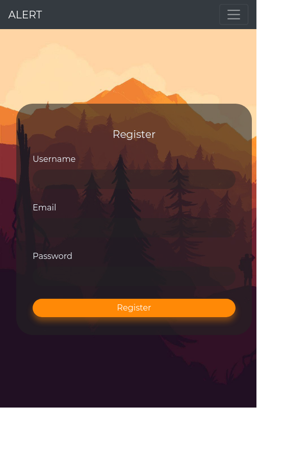
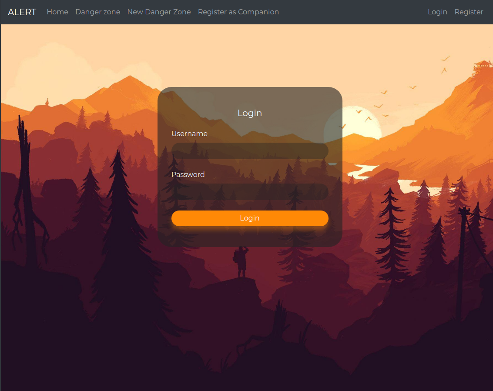
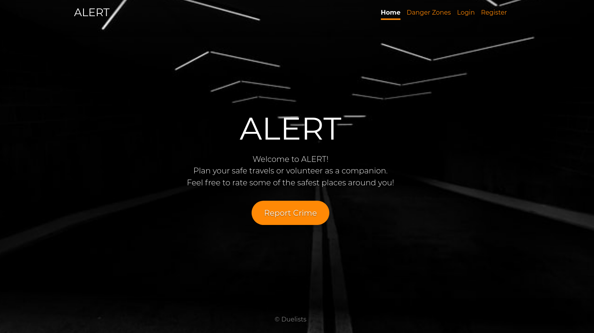
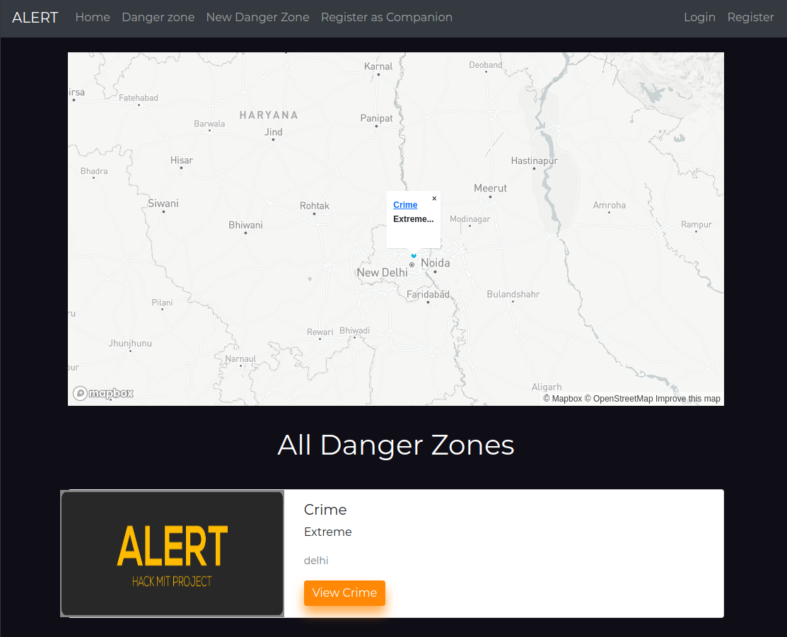

# HackMIT
 
## Installation

Install ALert with npm

Clone this repository with :
```bash
git clone ""
```

Install npm dependecies. Go to project root folder.

```bash
  npm install
  npm start
  sudo npm install -g --force nodemon
```

Start MongoDB in separate terminal:
```bash
  mongosh
```

## Tech Stack

- [Nodejs](https://nodejs.org/en/)
- [Express](https://expressjs.com/)
- [Mongo](https://www.mongodb.com/)

## Screenshots

Register Page



Login Page



Home Page



View Danger Zone Page



